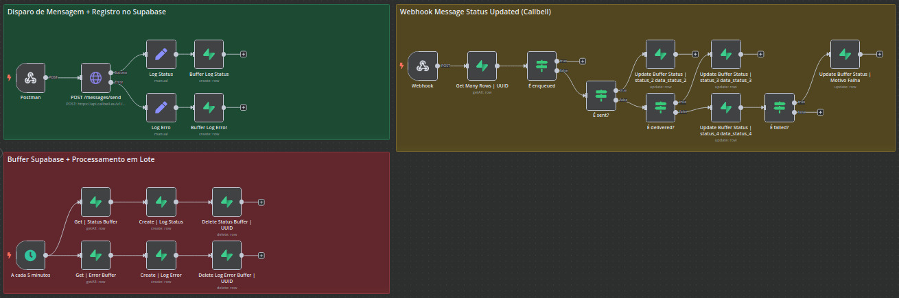
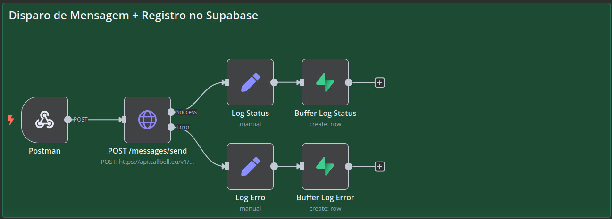
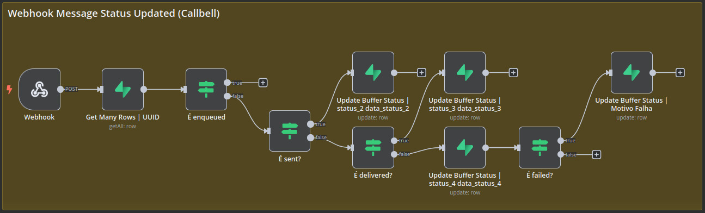
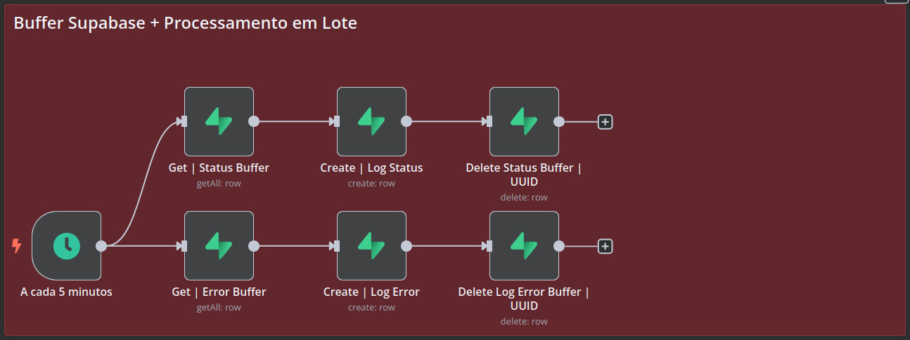

# callbell-message-monitoring

Esse projeto implementa uma solução para envio de mensagem via Callbell, monitorando cada status e armazenando erros no Supabase.

A estrutura conta com:
1. Registro de envio bem-sucedido
2. Detecção de erros
3. Armazenamento dos status das mensagens e erros em buffers
4. Processamento e migração em lot dos dados para as tabelas principais
5. Exclusão de dados do buffer após migração de dados

---

## Ferramentas/Tecnologias usadas

- [n8n](https://n8n.io)
- [Supabase](https://supabase.com)
- [Postman](https://www.postman.com)

---

## Estrutura

### Fluxo 1: Disparo de Mensagem + Registro no Supabase

1. Escuta um Webhook com informações como `nome` e `telefone` do contato  
   (Pode ser um Google Forms, Typeform, etc.)
2. Faz a requisição para `POST /messages/send` na API da Callbell  
   - **Sucesso:** Mapeia os dados em um Set e grava as informações em `status_mensagens_buffer` no Supabase  
   - **Erro HTTP/lógico:** Mapeia os dados em um Set e grava as informações em `log_mensagens_buffer` no Supabase

---

### Fluxo 2: Webhook Message Status Updated (Callbell)

1. Escuta o webhook `message_status_updated` da Callbell  
2. Consulta o `uuid` da mensagem recebida em `status_mensagens_buffer`  
3. Atualiza a tabela com base na seguinte lógica:

- Se status for `enqueued`, não faz nada  
- Se status for `sent`, as colunas `status_2` e `data_status_2` são atualizadas  
- Se status for `delivered`, as colunas `status_3` e `data_status_3` são atualizadas  
- O status final é registrado nas colunas `status_4` e `data_status_4`  
- Se o status final for `failed`, registra-se o motivo da falha na coluna `motivo_falha`  

---

### Fluxo 3: Migração dos dados dos buffers para as tabelas reais

`log_mensagens` e `log_mensagens_buffer`

1. A cada 5 minutos os dados das tabelas `log_mensagens_buffer` e `status_mensagens_buffer` são lidos  
2. Os dados são inseridos nas tabelas reais `log_mensagens` e `status_mensagens`  
3. É feita a exclusão dos dados salvos nas tabelas buffer  

---

## Tabelas do Supabase

### `log_mensagens` e `log_mensagens_buffer`

- `created_at`  
- `status_code`  
- `error_code`  
- `error_message`  
- `phone`  

### `status_mensagens` e `status_mensagens_buffer`

- `uuid`  
- `status_1`, `data_status_1`  
- `status_2`, `data_status_2`  
- `status_3`, `data_status_3`  
- `status_4`, `data_status_4`  
- `motivo_falha`
